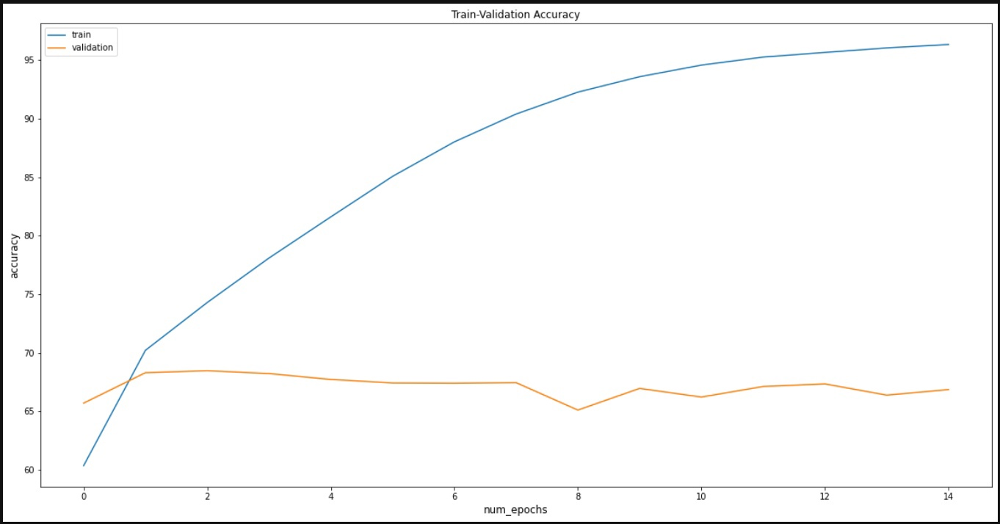
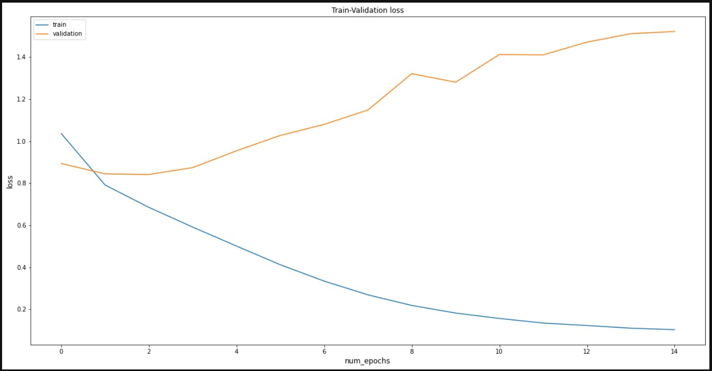
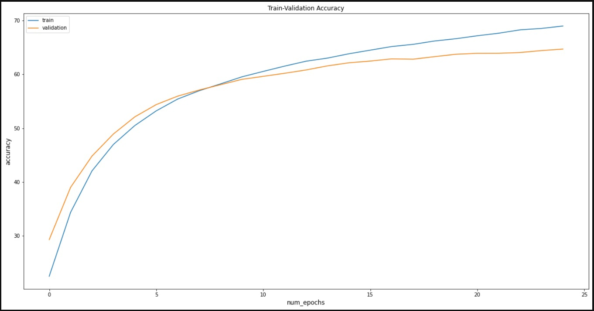
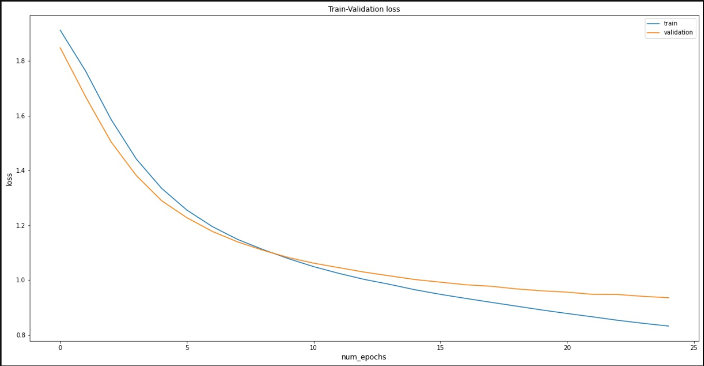

# EthnicityRecognition
A model for determining a person's race by his photo. You can upload a photo of a person and the model will give you which race the person in the photo belongs to

## Project structure

* Face_detector - code for training detection models
* models - code for the operation of neural networks designed for classification
* utils - data preprocessing

## Metrics
* ResNet 34 (1)

* ResNet 34 (2)

## Гиперпараметры
* 25 epoch
* 0.00009 lr
* Adam
* 128 batch-size

## Характеристики
* Best model - Resnet34 pre-trained + 2 linear layers
* Best test acc 70 %
* One image check time - 600ms